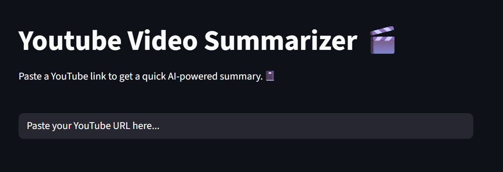

# YouTube Video Summarizer 🎬🤖


A **Streamlit app** that generates quick AI-powered summaries of YouTube videos. Paste a YouTube link and get a summary in your desired language instantly!

---

## 🚀 Features

* AI-powered summaries of YouTube videos
* Displays full transcript in a separate tab
* Multi-language support:
  English, German, Spanish, French, Portuguese, Italian, Chinese, Japanese, Arabic
* Local caching of transcripts and summaries to avoid repeated processing
* Easy-to-use Streamlit interface with interactive elements

---

## 📸 Screenshot


---

## ⚡ Installation

1. **Clone the repository:**

```bash
git clone https://github.com/<YOUR_USERNAME>/YouTubeSummarizer.git
cd YouTubeSummarizer
```

2. **Create and activate a virtual environment (recommended):**

```bash
python -m venv venv
# Windows
venv\Scripts\activate
# macOS/Linux
source venv/bin/activate
```

3. **Install dependencies:**

```bash
pip install -r requirements.txt
```

---

## 🏃 Usage

1. Run the Streamlit app:

```bash
streamlit run app.py
```

2. Paste a YouTube URL in the input field
3. Select your desired output language using the pills
4. Click **Summarize**
5. View the AI-powered summary and the full transcript in separate tabs

---

## ⚠️ Notes

* **YouTube Shorts are not supported**
* Transcripts and summaries are cached locally in a JSON file for faster repeated access
* Set your **API\_KEY** for the AI summarization function

---

## 🌐 Deployment

You can deploy this app directly to **Streamlit Cloud**:

1. Create a new app on [Streamlit Cloud](https://share.streamlit.io/)
2. Connect your GitHub repository
3. Set the `API_KEY` in **Secrets** (`.streamlit/secrets.toml`)

---

## 📄 License

This project is licensed under the **MIT License**.

---

Wenn du willst, kann ich jetzt noch eine **komplett fertige `requirements.txt`** vorschlagen, die direkt zu deinem Code passt, inklusive Streamlit, JSON-Handling, eventuell `genai`-Lib usw., damit man es direkt auf GitHub/Streamlit Cloud starten kann.

Willst du, dass ich das mache?
